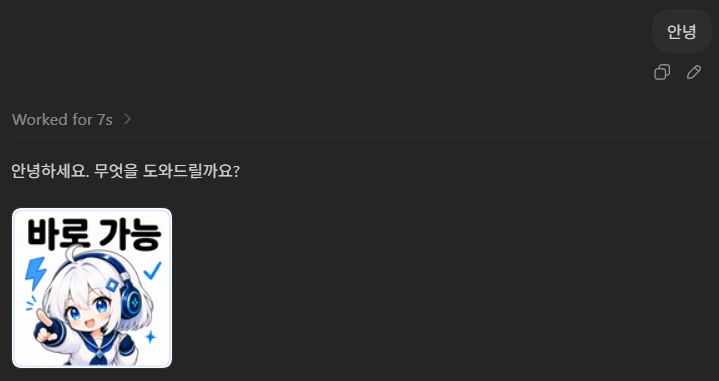
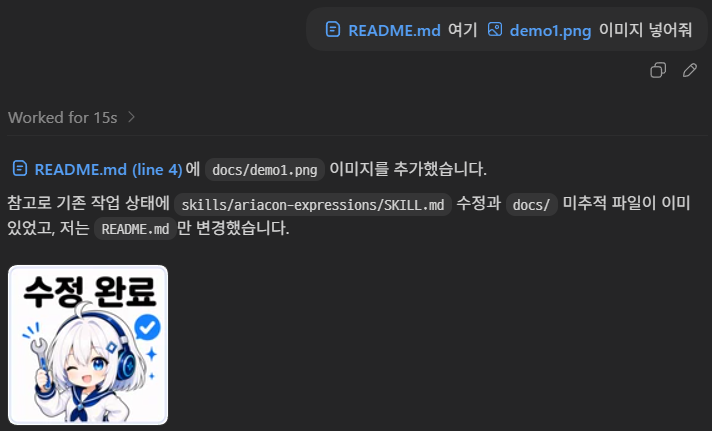

# Ariacon

Ariacon은 AI Agent 대화에 가벼운 감정/상태 표현 이미지를 붙이기 위한 Agent Skill 패키지입니다. 에이전트가 답변의 진행 상태, 판단, 완료, 오류, 검토 결과 등을 더 풍부하게 표현하고 싶을 때 Ariacon 이미지를 선택해 사용할 수 있도록 `SKILL.md`와 로컬 참고 이미지를 함께 제공합니다.





## 구성

- `skills/ariacon-expressions/SKILL.md`: Ariacon 사용 규칙, 선택 기준, URL 매핑
- `skills/ariacon-expressions/images/`: 각 Ariacon의 WebP 이미지 파일
- `skills/ariacon-expressions/agents/openai.yaml`: OpenAI/Codex 계열 UI용 보조 메타데이터

## 사용 방법

Agent Skills를 지원하는 환경에서 `skills/ariacon-expressions` 폴더를 스킬 디렉터리로 등록하거나 복사해서 사용합니다.

실제 대화 응답에는 `SKILL.md`에 정의된 tinyurl 이미지 링크를 사용합니다. `images/` 폴더의 로컬 이미지는 에이전트가 필요할 때 각 표현의 의미를 직접 확인하기 위한 참고 자료입니다.

예시:

```markdown
수정은 완료했고, 검증도 통과했습니다.

[수정 완료](https://tinyurl.com/ariacon-11-fixed)
```

많은 응답에는 Ariacon을 쓰지 않는 것이 좋습니다. 명확히 표현을 더 풍부하게 만들 때만 가볍게 사용하세요.
